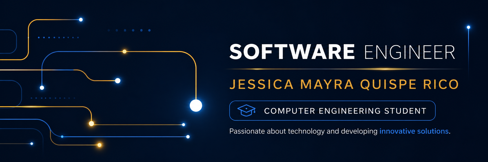

# About me
I am a software engineering student with an interest in backend development and artificial intelligence. I am motivated by building efficient solutions that combine sound logic with intelligent information management.
 
I have participated in the development of an ontology-based semantic search engine, implemented using Python, HTML, CSS, and JavaScript, where I worked on information structuring and retrieval to improve the accuracy of search results.
 
I am also involved in competitive programming, having qualified with my team for the ICPC regional competition—an experience that strengthened my problem-solving skills, algorithmic thinking, and ability to work under pressure.
 
Currently, I am a teaching assistant for Introduction to Programming at Universidad Mayor de San Simón, where I support student learning and further develop my communication and teaching skills.

 
I am B2 level in English, thanks to my education at the Bolivian American Center (CBA), which allows me to function effectively in international technical and collaborative environments.

# Education
**Universidad Mayor de San Simón (UMSS)**  
Bachelor's Degree in Software Engineering   
2022 – now

# Experience
**Teaching Assistant**  
I am a teaching assistant for the Introduction to Programming course.  
# Certifications
<table>
  <tr>
    <td valign="middle">
      
    </td>
    <td valign="middle">
      <b>Upper-Intermediate English Certificate</b> 
      <a href="https://www.cba.edu.bo/">Centro Boliviano Americano</a> 
      Issued: February 2025
    </td>
  </tr>

  <tr>
    <td valign="middle">
      
    </td>
    <td valign="middle">
      <b>ICPC Regional Contest Certificate</b> 
      <a href="https://icpc.global/">ICPC</a> 
      Issued: November 2024
    </td>
  </tr>

  <tr>
    <td valign="middle">
      
    </td>
    <td valign="middle">
      <b>Sansi Cup Programming Competition Certificate</b> 
      Universidad Mayor de San Simón (UMSS) 
      Issued: December 2025
    </td>
  </tr>

  <tr>
    <td valign="middle">
      
    </td>
    <td valign="middle">
      <b>ICPC Training Camp Certificate</b> 
      Universidad Mayor de San Simón (UMSS) 
      Issued: July 2025
    </td>
  </tr>

  <tr>
    <td valign="middle">
      
    </td>
    <td valign="middle">
      <b>Competitive Programming Workshop</b> 
      Universidad Mayor de San Simón (UMSS) 
      Issued: August 2024
    </td>
  </tr>
</table>

# Programming Languages
<table>
  <tr>
    <td valign="middle">
      
    </td>
    <td valign="middle">
      <b>Python</b> 
      General-purpose programming and problem solving
    </td>
  </tr>

  <tr>
    <td valign="middle">
      
    </td>
    <td valign="middle">
      <b>C++</b> 
      Algorithms and competitive programming
    </td>
  </tr>

  <tr>
    <td valign="middle">
      
    </td>
    <td valign="middle">
      <b>Java</b> 
      Object-oriented programming
    </td>
  </tr>
</table>

# Technologies

## Frontend
<table>
  <tr>
    <td valign="middle">
      
    </td>
    <td valign="middle">
      <b>HTML</b> 
      Structuring web pages
    </td>
  </tr>

  <tr>
    <td valign="middle">
      
    </td>
    <td valign="middle">
      <b>CSS</b> 
      Styling and layout for web interfaces
    </td>
  </tr>

  <tr>
    <td valign="middle">
      
    </td>
    <td valign="middle">
      <b>JavaScript</b> 
      Adding interactivity to web applications
    </td>
  </tr>

  <tr>
    <td valign="middle">
      
    </td>
    <td valign="middle">
      <b>Figma</b> 
      UI/UX design and prototyping
    </td>
  </tr>
</table>  

## Backend
<table>
  <tr>
    <td valign="middle">
      
    </td>
    <td valign="middle">
      <b>PostgreSQL</b> 
      Relational database management
    </td>
  </tr>

  <tr>
    <td valign="middle">
      
    </td>
    <td valign="middle">
      <b>MySQL</b> 
      Database design and querying
    </td>
  </tr>
</table>